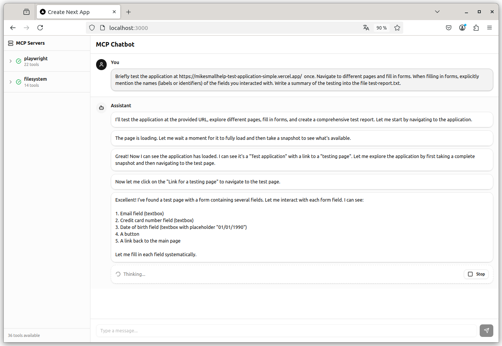

# MCP Chatbot

A chatbot application that integrates with Model Context Protocol (MCP) servers, allowing AI assistants to use external tools.



## Quick Start

1. Install dependencies:
   ```bash
   npm install
   ```

2. Set up environment variables in `.env.local`:
   ```
   AI_GATEWAY_API_KEY=your-api-key-here
   AI_GATEWAY_MODEL=openai/gpt-4o-mini
   ```

   The application uses [Vercel AI Gateway](https://vercel.com/docs/ai-gateway). Get your API key from the Vercel dashboard.

3. Run the development server:
   ```bash
   npm run dev
   ```

4. Open [http://localhost:3000](http://localhost:3000)

## Configuration

Edit `chatbot-and-mcp-servers-config.json` to configure MCP servers and settings:

```json
{
  "maxSteps": 50,
  "mcpServers": {
    "playwright": {
      "command": "npx",
      "args": ["@playwright/mcp@latest"],
      "description": "Browser testing and automation"
    },
    "filesystem": {
      "command": "npx",
      "args": ["-y", "@modelcontextprotocol/server-filesystem", "/path/to/folder"],
      "description": "Filesystem operations"
    }
  }
}
```

### Configuration Options

| Option | Description |
|--------|-------------|
| `maxSteps` | Maximum tool calls per question (default: 50) |
| `mcpServers` | MCP server configurations |
| `command` | Command to start the MCP server |
| `args` | Command arguments |
| `description` | Server description shown in sidebar |
